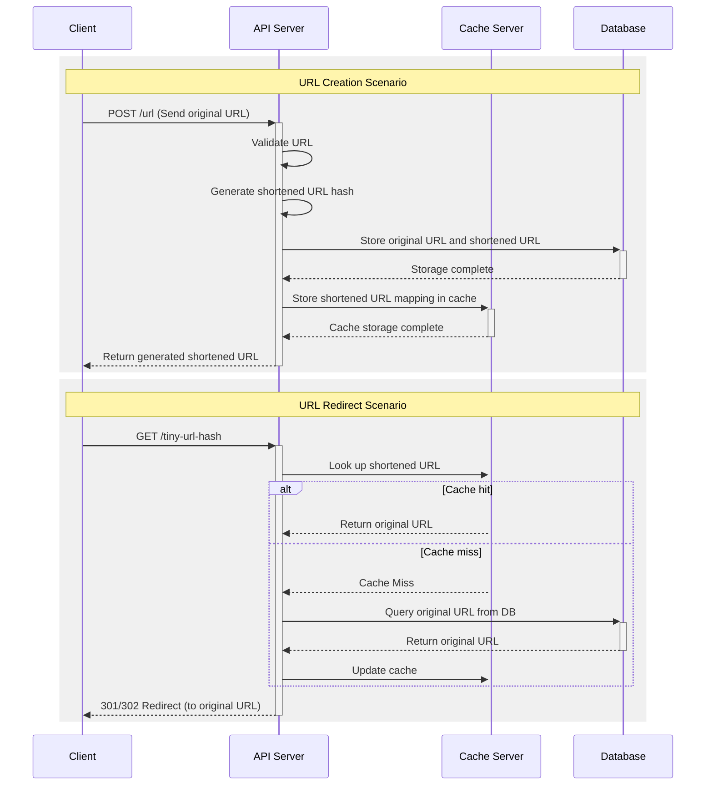

```mermaid
sequenceDiagram
    participant C as Client
    participant API as API Server
    participant Cache as Cache Server
    participant DB as Database
    
    %% URL Creation Scenario
    rect rgb(240, 240, 240)
    Note over C,DB: URL Creation Scenario
    C->>+API: POST /url (Send original URL)
    API->>API: Validate URL
    API->>API: Generate shortened URL hash
    API->>+DB: Store original URL and shortened URL
    DB-->>-API: Storage complete
    API->>+Cache: Store shortened URL mapping in cache
    Cache-->>-API: Cache storage complete
    API-->>-C: Return generated shortened URL
    end
    
    %% URL Redirect Scenario
    rect rgb(240, 240, 240)
    Note over C,DB: URL Redirect Scenario
    C->>+API: GET /tiny-url-hash
    API->>+Cache: Look up shortened URL
    alt Cache hit
        Cache-->>API: Return original URL
    else Cache miss
        Cache-->>API: Cache Miss
        API->>+DB: Query original URL from DB
        DB-->>-API: Return original URL
        API->>Cache: Update cache
    end
    API-->>-C: 301/302 Redirect (to original URL)
    end
```
