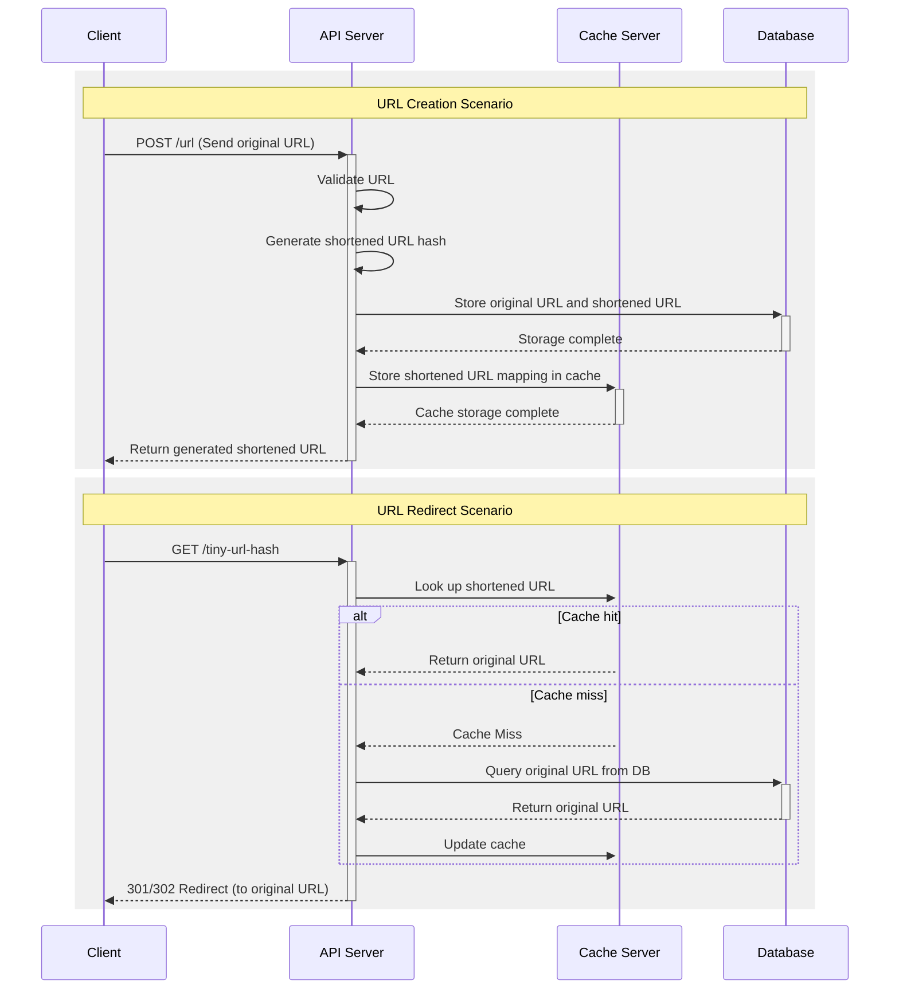

## API Definition

### Overview

This API provides a URL shortening service where users can generate tiny URLs and be redirected to the original URLs.

### Endpoints

#### 1. Create Tiny URL

- **Request:**

```http
POST /urls
Content-Type: application/json

{
  "originalUrl": "https://example.com"
}
```

- **Response:**

```http
HTTP/1.1 200 OK
Content-Type: application/json

{
  "tinyUrl": "https://short.ly/abc123"
}
```

#### 2. Redirect to Original URL

- **Request:**

```http
GET /{tinyUrl}
```

- **Response:**

```http
HTTP/1.1 301 Moved Permanently
Location: https://example.com
```

## Sequence Diagram

