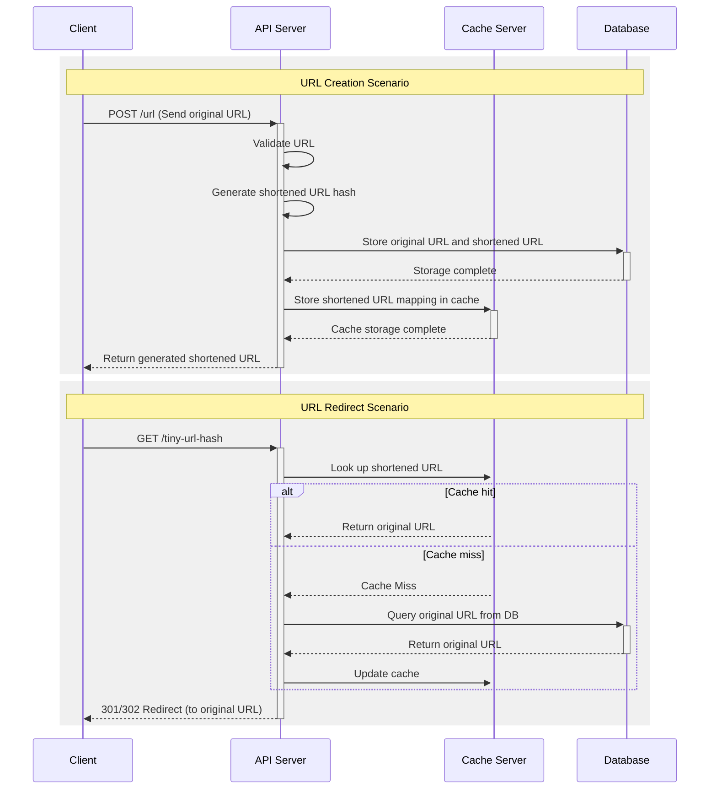

## 1. API Definition

### Overview

This API provides a URL shortening service where users can generate tiny URLs and be redirected to the original URLs.

### Endpoints

#### 1. Create Tiny URL

- **Request:**

```http
POST /urls
Content-Type: application/json

{
  "originalUrl": "https://example.com"
}
```

- **Response(Success):**

```http
HTTP/1.1 200 OK
Content-Type: application/json

{
  "tinyUrl": "https://short.ly/abc123"
}
```

- **Response(Error):**
- In case of an invalid request (e.g., missing or malformed originalUrl), the API will return an error response:

```http
HTTP/1.1 400 Bad Request
Content-Type: application/json

{
  "error": "Invalid URL format"
}
```

```http
HTTP/1.1 500 Internal Server Error
Content-Type: application/json

{
  "error": "Server error, please try again later"
}
```

#### 2. Redirect to Original URL

- **Request:**

```http
GET /{tinyUrl}
```

- **Response(Success):**

```http
HTTP/1.1 301 Moved Permanently
Location: https://example.com
```
- **Response(Error):**

```http
HTTP/1.1 404 Not Found
Content-Type: application/json

{
  "error": "Tiny URL not found"
}
```

<br>

## 2. Sequence Diagram


<br>

## 3. Running the Server Locally

1. Clone the repository:
   ```bash
   git clone https://github.com/devmanta/tiny-url.git

2. Navigate to the root directory of the cloned repository:
   ```bash
   cd tiny-url # Example

3. Start the server with Docker Compose:
   ```bash
   docker-compose up -d

4. To stop the server, run:
   ```bash
   docker-compose down
